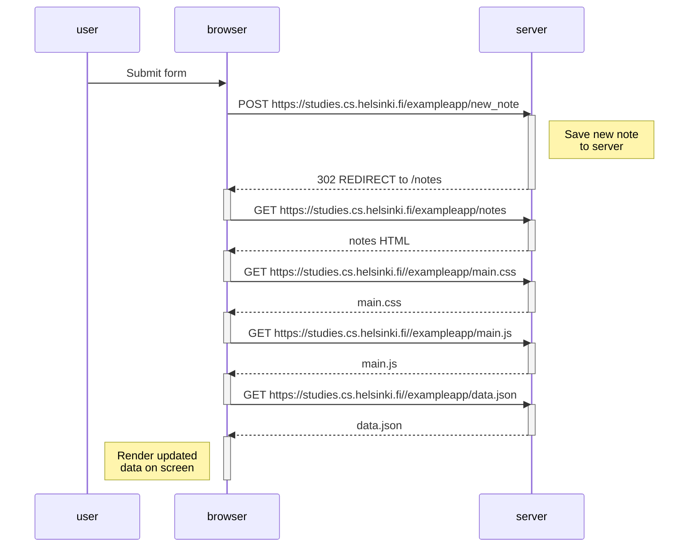

```mermaid
sequenceDiagram
    participant user
    participant browser
    participant server

    user->> browser: Submit form

    browser->>server: POST https://studies.cs.helsinki.fi/exampleapp/new_note
    activate server
    Note right of server: Save new note <br> to server
    server-->>browser: 302 REDIRECT to /notes
    deactivate server
    activate browser


    browser->>server: GET https://studies.cs.helsinki.fi/exampleapp/notes
    deactivate browser
    activate server
    server-->>browser: notes HTML
    deactivate server

    activate browser
    browser->>server: GET https://studies.cs.helsinki.fi//exampleapp/main.css
    deactivate browser
    activate server
    server-->>browser: main.css
    deactivate server

    activate browser

    browser->>server: GET https://studies.cs.helsinki.fi//exampleapp/main.js
    deactivate browser
    activate server
    server-->>browser: main.js
    deactivate server

    activate browser

    browser->>server: GET https://studies.cs.helsinki.fi//exampleapp/data.json
    deactivate browser
    activate server
    server-->>browser: data.json
    deactivate server

    activate browser
    Note left of browser: Render updated <br> data on screen
    deactivate browser

```